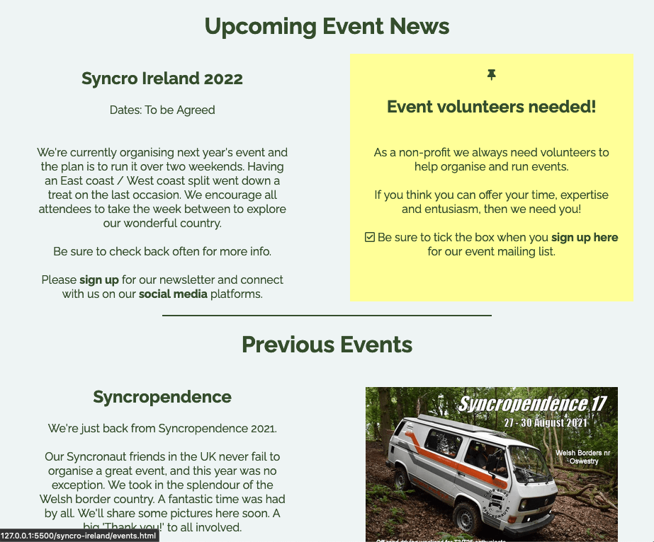
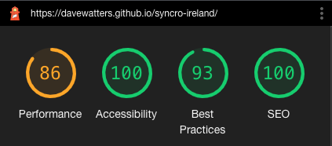

# Syncro Ireland

## The Home of Ireland's Annual VW Syncro 4x4 Event
Syncro Ireland was built to become the main focal point of an annual Irish event for VW Syncro enthusiasts. The site aims to promote and encourage engagement from the community across the island of Ireland, the UK, and international visitors.  The organiser's goal is to encourge enthusiasts to sign up to receive news regarding Syncro (and other 4x4) events, and to build a cohort of volunteers to ensure the event's continued success.

You can view the Syncro Ireland live site [HERE.](https://davewatters.github.io/syncro-ireland)
 
 

<!-- Responsive desgin sample image from http://ami.responsivedesign.is/ -->
<h2 align="center"></h2>

## - Table of Contents -
* [Purpose](#purpose)
* [User Experience Design (UX)](#user-experience-design)
* [Features](#features)
* [Technologies](#technologies)
* [Testing](#testing)
* [Deployment](#deployment)
* [Credits](#credits)

## - Purpose -
[ This website was created as the first Portfolio Project (PP1) for the Code Institute's Full Stack Web Development course. ]

The site was built to become the main focal point of an annual Irish event for VW Syncro enthusiasts. The target audience are mostly VW Syncro owners, but extends to all other 4x4, off-roading and camper van enthusists. The organisers had been using various other media (Facebook; online club forum) to get information out to the channel, with mixed success. They realised that there was no single online destination to find out about events in Ireland and connect all interested parties. This made it difficult to build momentum for an event idea. It was realised that a registration portal was needed to inform those interested in attending, and, in fact, a register of volunteers was needed to help make the event happen.  This site aims to fulfill those needs for both the organisers and attendees.

## - User Experience Design -

-   ### User stories

    -   ### Design Strategy Goals
        -    Create an online presence to promote the annual Irish event
        -    Site must inform vistors about future and past events
        -    Create a registration form to:
                - capture contact details of those interested in receiving event news
                - capture contact details of those interested in volunteering at events
                - allow the user to submit suggestions or feedback 
        -    Site must be intuitive to read & navigate on both desktop & mobile devices

    -   ### Design Scope to Deliver MVP
        -   #### First Time Visitor Goals
            As a first time user...
            -   I want to easily understand the main purpose of the site and learn more about the organisation
            -   I want to be able to easily navigate throughout the site to find content
            -   I want to find their social media links to follow event news

        -   #### Returning Visitor Goals
            As a returning visitor...
            -   I want to be able to easily register my interest in attending an event
            -   I want to find the best way to get in contact with the organisers with any questions or suggestions I may have
            -   I want to be able to view the site clearly on a mobile device

        -   #### Frequent User Goals
            As a frequent user...
            -   I want to to see if there are any new events happening
            -   I want to to see if there are any updates on a forthcoming event
            -   I want to see any new photos or videos of previous events or related acitivites

-   ### Design
    -   #### Layout
        A simple 3-5 page structure was discussed to satisfy and separate the strategy goals of promote, inform & register, and also allow for expansion to other pages - for example, a gallery page of images of events/attendees/vans etc., and possibly a page dedicated to the history of the VW Syncro van. For the purposes of delivering an MVP to a tight deadline, the three-page structure was decided upon to ensure it was feasible to deliver the important design strategy goals.  
        The site must appeal to a Syncro/4x4 enthusiast and present the information in a clear, accessible and obvious way whether on mobile devices or larger screens. To achieve this, page navigation links are laid out the same at the top of each page, as are links to relevant social media platforms on the bottom of each page.  
        The main page is a brief, but comprehensive introduction with all navigation links visible. The registration form link is presented as 'Sign Up!' - this is an obvious call-to-action.  
        The events page clearly presents upcoming & past event news items which remain in the correct order when the layout changes in response to various screen sizes. It also includes any important event announcements (e.g. request for volunteers), presented as a mock Post-It note, to highlight the message and the call-to-action.  
        The registration form page presents a simple form for required user contact details with a choice to enter a comment or question, a check a box to volunteer, and a submit button.  
        Throughout the site all links & buttons use high contrast colours on hover or click, or when in a form data field, to provide clear visual feedback to the user when an action is taken.  All pages use images of Syncro vans at events, or in off-road locations, which appeal to the target audience and are likely to elicit a positive emotional response.  

    -   #### Colour Scheme
        To highight the Irish identity of the site, a green/white/gold variation was used throughout the site. I chose to base these colours on actual official VW paint colours as used on the Syncro vans (e.g. VW Escorial Green), so this design choice should also feel familiar to the site's users. The choice for the background was between an off-white VW Pastel White, Ford Polar and a Chrysler Arctic White, all of which have 'AAA' WCAG 2.0 contrast scores when used as text on the green background (i.e in the header & footer). The results of the colour contrast testing are included in the [Testing](#testing) section below.

        - Colour choices
            - Ford Polar White, #eef4f4
            - VW Escorial Green, #344d2c
            - VW Brilliant Yellow, #edda1c

        - How colours were used
            - Body: White
            - Header: Green 
            - Footer: Green
            - Content text: Green on White or White on Green, as applicable
            - Highlights (Active/Selected/Border): Yellow

    -   #### Typography
        -  The Google font, Raleway, was chosen as its unique 'W' bears some resemblance to the W in the iconic VW logo.

    -   #### Imagery
        -   The main page uses a large hero image to grab the user's attention.  It is instantly recognizable as a Syncro camper van in a remote and rugged mountain landscape. Other images used on the site show Syncro vans involved in off-roading action during previous events. An embedded video can be played which is a montage of amateur enthusiast phone footage from a previous event.  All of this is very relatable and relevant to the target audience and should encourage users to connect with the organisers and want to attend events. 

## - Features -
To fulfil the needs of the site owner and its users, the following features were implemented:
-   **Navigation Bar** contains the site name/logo and links to the Home, Events and SingUp pages. It is identical on, and positioned at, the top of all pages. It is fully responsive on different device sizes. The currently selected page is indicated with a bright yellow underline and the items change colour when the mouse hovers over them to give the user immediate visual feedback.
    -   This allows the user to navigate intuitively between the site's pages
<h2 align="center"></h2>
<h2 align="center"></h2>
   
-   **Home Page Image** is a large hero image.  It is instantly recognizable as a Syncro camper van in a remote and rugged mountain landscape.
    -   This grabs the visitor's attention and appeals to their similar interests. It should encourage them to continue reading and engage with the site.  The organiser wants to appeal to this demographic. 
<h2 align="center"></h2>

-   **Main Introduction Section** explains to the visitor what the purpose of the site is and presents options for them to get involved and sign up for news and connect on social media.  There is also an image of a van tackling a water obstacle as part of a previous event.
    -   The visitor is informed of the site's intentions regarding organising an annual event. They see an image of a van in off-road action which gives them a sense of the type of exciting activites that take place at events.
<h2 align="center"></h2>

-   **Site Footer** contains links to Syncro Ireland social meadia platforms. The links open in a new browser tab. The footer is identical on each page of the site.
    -   Visitors can easily connect with the event's social media platforms as it appears at the bottom of each page. When the user hovers the mouse over the icon it changes to a bright yellow colour to highlight the choice.  The owner makes it as easy as possible to gain followers on social media.
<h2 align="center"></h2>
<h2 align="center"></h2>

-   **Events Page** is presented in sections showing upcoming events first, followed by previous event news, images or videos where applicable.  Important notices or calls-to-action are presented in mock Post-It note style.
    - All relevant information that a user might want regarding upcoming events is here.  Important news or notices are also here and is in an attention-grabbing style. The user can also browse old event news from Ireland and elsewhere, view pictures and watch event videos. The site owner is assured that the event news and the call for community engagement is being noticed.
<h2 align="center"></h2>

-   **Signup Page** contains the form which allows the user to register their interest in upcoming events, provide feedback to the organisers and indicate that they would like to volunteer to help at the events. There are only three fields of contact information required, and two optional. The fields are clearly defined and highlighted to make it easy to fill out on screens of any size.  There is error checking built in to ensure the required fields are not left blank. When they submit the data, the user is alerted if they have missed one and can rectify it easily. 
    -   This allows the user to easily register their interest in attending events and submit suggestions or questions to the organisers. This benefits the organiser by having one central, organised method for collecting a database of interested attendees and volunteers. This can be used as a newsletter mailing list and as an aid to planning events.
<h2 align="center"></h2>

## - Technologies Used -

### Languages Used

-   [HTML5](https://en.wikipedia.org/wiki/HTML5)
-   [CSS3](https://en.wikipedia.org/wiki/Cascading_Style_Sheets)

### Frameworks, Libraries & Programs Used

1. [Git](https://git-scm.com/)
    - Git was used for version control and managed via the VSCode terminal to commit to Git and Push to GitHub.
1. [GitHub:](https://github.com/)
    - GitHub is used to store the project's code after being pushed from Git, and Github Pages used to deploy the live site
1. [Google Fonts:](https://fonts.google.com/)
    - Google font 'Raleway' was imported in the style.css file and used throughout the site.
1. [Font Awesome:](https://fontawesome.com/)
    - Font Awesome was used to add icons for aesthetic and UX purposes.
1. [Gimp:](https://www.gimp.org/)
    - Gimp was used to edit and retouch photos for the website.
1. [Birme:](https://www.birme.net/)
    - birme.net was used to resize images.
1. [TinyPNG:](https://tinypng.com/)
    - tinypng.com was used to compress large images

## - Testing -
### UX Goals, User Stories
-   #### As a first time user...
    -  I want to easily understand the main purpose of the site and learn more about the organisation
        -   The main landing page was checked to ensure it explains the purpose of the allows the visitor to explore for more information 
    -  I want to be able to easily navigate throughout the site to find content
        - The navigation links were checked on each page to ensure that they take the user to the intended page or section and there were no broken links 
    -  I want to find their social media links to connect and follow event news
        - Each page was checked to confirm that the footer contained the same links and that they would open the event's page on the correct media platform in a new browser window.

-   #### As a returning visitor...
    -  I want to be able to easily register my interest in attending an event
        -   The signup registration form was tested to ensure that the user could complete and submit it in a few easy steps. It was also tested to ensure the user could not submit with out filling in the three required contact fields. 
    -  I want to find the best way to get in contact with the organisers with any questions or suggestions I may have
        -   The signup/feedback form was tested to ensure that the user could submit a custom message
    -  I want to be able to view the site clearly on a mobile device
        -   Testing was done to ensure that the site was responsive on all device screen sizes and that the information was clear and accesible.

-   #### As a frequent user...
    -  I want to to see if there are any new events happening
        -   I tested to ensure that upcoming event news was shown on the events page
    -  I want to to see if there are any updates on a forthcoming event
        -   I tested to ensure that updates on upcoming events was shown on the events page
    -  I want to see any new photos or videos of previous events or realted acitivites
        -   I tested to ensure photos and videos of previous events was present on the events page. Video playback was tested.

### Code Validation
The [W3C Markup Validator](https://validator.w3.org/#validate_by_uri) and [W3C CSS Jigsaw Validator](https://jigsaw.w3.org/css-validator/#validate_by_uri) services were used to validate every page of the project for syntax errors. **NOTE: All validation was re-run after fixing the errors shown below to ensure that no further errors or warnings existed.**

-   index.html Warning: errant `<section>` was replaced with a `
` as `hero-section` is for decoration only and has no semantic use
<h2 align="center"></h2>

-   events.html Error: embeded video link code was actually generated by YouTube, but I removed the attribute to fix this
<h2 align="center"></h2>

-   signup.html Error: stray tag was deleted
<h2 align="center"></h2>

-   style.css: two stray commas were found and deleted
<h2 align="center"></h2>

### Responsiveness
- Chrome DevTools and a Chrome extension, [Unicorn Revealer](https://chrome.google.com/webstore/detail/unicorn-revealer/lmlkphhdlngaicolpmaakfmhplagoaln?hl=en-GB), were used to check responsiveness on various device sizes. Some issues were found at the 320px screen size where the logo and footer elements were breaking the screen width (as shown in the image below). I could see in DevTools that they had `width: 400px` applied, and changing the media query for 400px or smaller screens to `max-width: 320px` would fix the issue. The code was fixed accordingly.
<h2 align="center"></h2>

### Colour Scheme
The colour scheme was tested using this [Contrast Grid Test](https://contrast-grid.eightshapes.com)
and, as explained previously in the Design - [Colour Scheme](#colour-scheme) section, my decision was based on the results shown here:
<h2 align="center"></h2>

-   The Website was tested on Firefox, Safari, Chrome and Edge browsers.
-   The website was viewed on a variety of mobile devices such as iPhone7, iPhone 8 & iPhoneX.
-   The organiser of Syncro Ireland Events was asked review the site to point out any user experience issues

### Form Data Validation
The signup form was tested to ensure that the user could not submit without data in the required fileds. An example is shown below where the user has left the required Lastname field empty:
<h2 align="center"></h2>
The next image is a snip from the Code Institute's form dump test page showing data correctly posted to the backend:
<h2 align="center"></h2>

### Further Testing
Googe Lighthouse in Chrome DevTools was used after deployment to test the quality and performance of the site.  Initial results were satisfactory for Accessibility (100), Best Practises (93) and SEO (100), but performance was not so good with an amber score of 81. Examination of the audit trail showed that very large image file sizes were causing the lag in performance (particularly the hero image). Images were then optimized by first resizing using [Birme](https://www.birme.net), and then compressing using [TinyPNG](https://tinypng.com). After re-testing, the Lighthouse audit result was as follows:
<h2 align="center"></h2>

### Bugs

1.  Supplied event promo video wouldn't play when embedded due to there being copyrighted music on the sondtrack. 
    -   Fixed by editing the video to remove the copyrighted soundtrack
1.  footer slightly off-centre on screens below 320px
    -   Fixed with media query edit
<!--  -->
<!-- end of testing section -->
<!--  -->

## - Deployment -

### GitHub Pages
The live deployed site can be viewed on GitHub Pages [HERE](https://davewatters.github.io/syncro-ireland)

The Project repository (repo) is at [https://github.com/davewatters/syncro-ireland](https://github.com/davewatters/syncro-ireland)

Note: The project repo was initially generated from the [Code Institute full template](https://github.com/Code-Institute-Org/gitpod-full-template) 

Deployment of the site to GitHub Pages was done as follows:

After final `git push` to the project repo 
1.  Login to your GitHub account
1.  Open the project repo 
1.  Select the 'Settings' tab
1.  On the left-hand-side menu select the Pages option
1.  Select the main branch as the source, then click the save button
1.  A message will confirm that the site has been published at `https://YOUR-GITHUB-NAME.github.io/REPO-NAME/`
1.  Test that the site has successfully gone live live by clicking on the link

## - Credits -

### Code
-   Whilst no major code was 'lifted' from other sources, I looked to many sources for inspiration and help: Code Institute walkthrough projects, other CI users' projects, live web sites, Stackoverflow, CSS Tricks.. and many others. 
-   README.md - The structure was arrived at by examining the Code Institute sample templates and some previous CI users' projects. In particular, the Table of Contents idea came from Daisy McGirr's milestone project [HOTD](https://github.com/Daisy-McG/MilestoneProject-1)

### Content

-   All content created by the site creator [David Watters](https://github.com/davewatters/). Whilst some copy was taken, with permission, from the [Eire Syncro Facebook page](https://www.facebook.com/pages/category/Event/Eire-Syncro-261159948060757/) and the [UK Syncro Club](https://club8090.co.uk/) site, most text was edited and reworded after discussions with an organiser of the Syncro Ireland event, Paul Gillett.
-   All images were either supplied by the Syncro Ireland event organiser, Paul Gillett [ [Vantopia.ie](https://vantopia.ie) ], or supplied with kind permission by the [UK Syncro Club](https://club8090.co.uk/).  Some editing, retouching and resizing was done by the site creator.
-   Many thanks to my partner [Deirdre Treacy](https://linkedin.com/in/thedeetreacy) for removing the copyrighted soundtrack from the organiser's supplied promo video. 

### Acknowledgements

-   My mentor [Daisy McGirr](https://github.com/Daisy-McG) for all her helpful feedback.  And for introducing me to the illuminating Chrome extension [Unicorn Revealer](https://chrome.google.com/webstore/detail/unicorn-revealer/lmlkphhdlngaicolpmaakfmhplagoaln?hl=en-GB)
-   The wonderful Code Institute community on Slack and the CI staff and students - newbies and seasoned devs alike - for all of their help and support. 
-   And finally... Thanks to fellow student Stephen Darcy [CI Slack: @Stephen_5P] for suggesting [Birme](https://www.birme.net/) for bulk resiszing of images - what a time saver it turned out to be!
